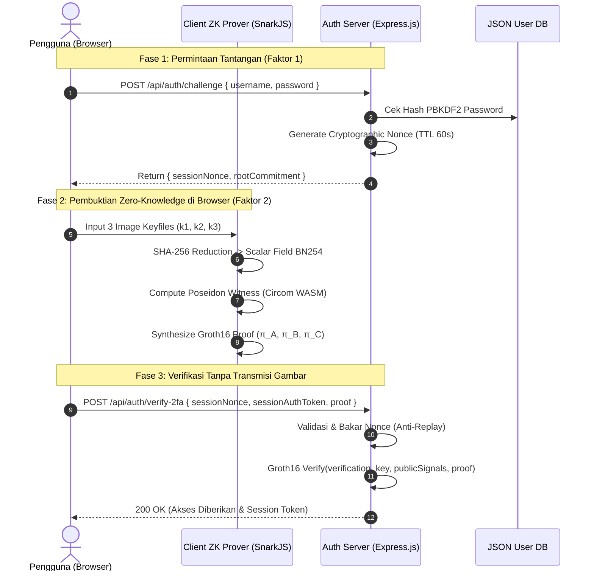

# 🔐 Zero-Knowledge Multi-Image Keyfile 2FA

[](https://docs.circom.io/)
[](https://github.com/iden3/snarkjs)
[]()
[](LICENSE)

Sistem Otentikasi Faktor Kedua (2FA) berbasis **Zero-Knowledge Proof (ZKP)** yang memverifikasi kepemilikan 3 berkas gambar statis (*multi-image keyfiles*) menggunakan sirkuit aritmatika **Circom 2.0** dan protokol **Groth16** pada kurva BN254.

Berbeda dari 2FA konvensional (SMS OTP yang rentan *SIM-swap*, atau authenticator app yang rentan *device-cloning*), sistem ini menjamin **100% Zero Data Leakage**: gambar fisik tidak pernah diunggah, disimpan, atau ditransmisikan ke jaringan/server.

---

## 🌟 Fitur Utama

- **Zero-Knowledge Verification (Groth16 zk-SNARKs)**: Server memverifikasi keabsahan bukti kepemilikan kunci tanpa pernah mengetahui isi piksel maupun hash asli dari ketiga gambar kunci.
- **Hierarchical Poseidon Hashing**: Menggabungkan reduksi deterministik SHA-256 (Big-Endian modulo BN254 scalar field $) dengan *field-native Poseidon Hash* untuk efisiensi constraint sirkuit R1CS yang optimal (< 2.000 constraints).
- **Zero-Noise Tolerance**: Modifikasi bahkan sebesar 1-bit atau 1-piksel pada salah satu gambar akan langsung menggagalkan sirkuit secara deterministik di sisi browser (*Circuit Constraint Rejection*).
- **Cryptographic Anti-Replay Nonce**: Server menerbitkan challenge nonce dinamis berbasis waktu (TTL 60 detik) yang dibakar (*single-use burn*) seketika setelah diverifikasi.
- **Dual-Factor Authentication Gate**:
  - **Faktor 1**: Master identity (Username + Password bergaram PBKDF2 10.000 iterasi).
  - **Faktor 2**: Bukti ZK-Proof kepemilikan 3 file gambar statis.
- **Smart Contract Ready**: Disertai kontrak Solidity `MultiImageVerifier.sol` & `MultiImage2FAVault.sol` yang siap di-deploy ke jaringan EVM (Ethereum / Arbitrum / Polygon).

---

## 🏗️ Arsitektur Sistem



---

## 📊 Metrik & Kinerja Kriptografi

| Komponen | Spesifikasi / Pengukuran | Catatan |
| :--- | :--- | :--- |
| **Kurva Eliptik** | BN254 (alt_bn128) |  = 21888242871839275222246405745257275088548364400416034343698204186575808495617$ |
| **Hash Function** | Poseidon (Circomlib v2) | SNARK-friendly, konsumsi constraint ~8x lebih hemat dari SHA-256 di R1CS |
| **Ukuran Sirkuit** | ~1.400 Constraints | Ringan, dapat disintesis di perangkat low-end |
| **Waktu Proof (Browser)** | ~500 - 700 ms | Diproses di WebAssembly client-side |
| **Waktu Verifikasi (Server)**| < 50 ms | Pure JavaScript Pairing Check |
| **Ukuran Proof** | ~256 bytes | Sangat efisien untuk transmisi HTTP maupun transaksi on-chain |

---

## 🚀 Memulai (Quickstart)

### Prasyarat
- [Node.js](https://nodejs.org/) v18+ atau v20+
- Web browser modern (Chrome, Firefox, Edge, Safari)

### 1. Kloning Repositori
```bash
git clone https://github.com/username/zk-multi-image-keyfile-2fa.git
cd zk-multi-image-keyfile-2fa
```

### 2. Pasang Dependensi
```bash
npm install
```

### 3. Jalankan Pengujian Otomatis (14 Unit & E2E Tests)
```bash
npm test
```
*Hasil uji mencakup: Sintesis Groth16, verifikasi valid proof, penolakan 1-bit tampered image (Zero-Noise Tolerance), pertahanan Replay Attack, dan penolakan expired nonce.*

### 4. Jalankan Server Aplikasi
```bash
npm start
```
Buka browser Anda di **`http://localhost:3000`**.

---

## 🧪 Skenario Pengujian Kunci

1. **Pendaftaran Akun**:
   - Buka tab **Daftar**.
   - Masukkan username & password.
   - Klik tombol **📥 Unduh Kunci Contoh** untuk mengunduh 3 file kunci PNG contoh, atau gunakan 3 foto pribadi dari komputer Anda.
   - Klik **Daftarkan Akun**.
2. **Login Normal**:
   - Buka tab **Masuk**, isi username, password, dan masukkan 3 file gambar yang sama.
   - Klik **Masuk** $
ightarrow$ Verifikasi berhasil dalam < 1 detik.
3. **Uji Zero-Noise Tolerance**:
   - Ganti salah satu gambar dengan file gambar lain saat login.
   - Sistem akan langsung menolak di tingkat sirkuit (*Constraint Assert Failed*) tanpa membocorkan apapun ke server.

---

## 📁 Struktur Direktori

```text
├── circuits/                       # Arithmetic Circuit Definition
│   ├── MultiImageKeyfile2FA.circom # Sirkuit Circom utama
│   └── build/                      # WASM prover & ZKey Groth16 parameter
├── client/                         # Frontend Web App
│   ├── index.html                  # Antarmuka web minimalis
│   └── src/
│       ├── main.js                 # Orkestrasi alur login & pendaftaran
│       ├── styles/main.css         # Styling modern & responsif
│       └── crypto/                 # Deterministic hash, Poseidon, & ZK Prover
├── contracts/                      # Smart Contracts
│   ├── MultiImageVerifier.sol      # Solidity Groth16 On-chain Verifier
│   └── MultiImage2FAVault.sol      # On-chain 2FA Protected Vault
├── server/                         # Backend API Server
│   └── src/
│       ├── app.js                  # Entry point Express.js
│       ├── authController.js       # Controller Challenge & Verify
│       ├── nonceManager.js         # Anti-replay nonce manager
│       └── db.js                   # Penyimpanan user terenkripsi
└── tests/                          # Automated Test Suite
    ├── circuit.test.js             # Uji sirkuit & constraint Circom
    ├── hash.test.js                # Uji determinisme reduksi field
    └── e2e.test.js                 # Uji end-to-end & skenario serangan
```

---

## 📜 Lisensi
Didistribusikan di bawah lisensi MIT. Silakan gunakan untuk pembelajaran, riset, atau pengembangan lebih lanjut.
